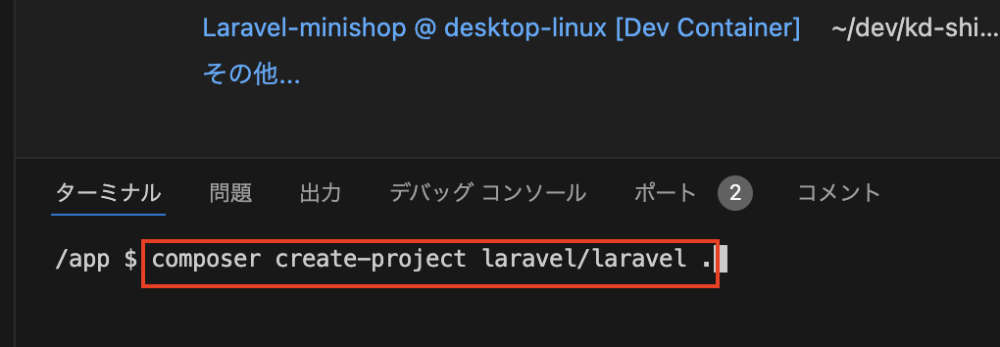
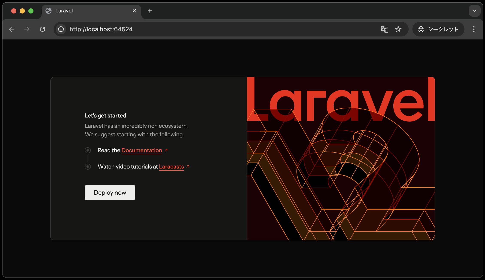

# Laravel環境の構築

後期の授業も、前期同様**コンテナを起動しアプリケーションを実行する**ことは変わりません。
ですが、Laravel環境を構築する上で、前期とは違った手順を踏む必要があります。

以降の章でも同じことを繰り返しやっていくことになりますので、しっかりと理解しておきましょう。

1. VSCode上で、`Ctrl+Shift+P`(Macの場合は`Cmd+Shift+P`)を押し、コンテナを起動する(**前期同様初回のみ時間がかかる**)
2. VSCode上で、`Ctrl+J`(Macの場合は`Cmd+J`)を押し、ターミナルを表示する
3. ターミナルに`composer create-project laravel/laravel .` と入力し、`Enter`で実行する<br>
   
4. 30秒〜1分ぐらいして、以下のような表示がでれば、プロジェクトの作成完了となる(※2回目以降、コンテナを起動後に、上記コマンド`composer create-project laravel/laravel .`を実行する必要なし)<br>
   
5. 画面下部のポートから「web:80」の地球儀マークをクリックし、`http://localhost:{ポート番号}/`にブラウザでアクセスする<br>
   
6. 以下のような、画面が表示されればOK<br>
   

```note

Laravelを少しでも勉強している方はご存知かもしれませんが、Laravelのサーバーを起動するためには、本来は以下のコマンドを実行する必要があります。

```bash
php artisan serve
```

```

ただし、本授業ではコンテナ起動時に自動でサーバーが起動するため、上記のコマンドを実行する必要はありません。

## Laravelのディレクトリ構造

Laravel環境を構築することにより、clone直後と比較してディレクトリ構造が変わっていることに気づいたと思います。

**【Laravel構築前】**


**【Laravel構築後】**


ここでは、本授業で使用する主なディレクトリなどについて説明します。

- **app**: アプリケーションのコアコード(コントローラ、モデルなど)が格納されるディレクトリ
- **database**: データベース関連(マイグレーション、シーダーなど)のファイルが格納されるディレクトリ
- **public**: パブリックアクセス可能なファイル(画像、cssなど)が格納されるディレクトリ
- **resources**: ビューなどのリソースが格納されるディレクトリ
- **routes**: ルーティングファイルが格納されるディレクトリ
- **.env**: 環境設定ファイル